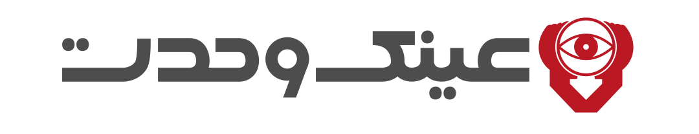

<p align="center">
    
    <br />
    <a href="https://www.npmjs.com/package/chonky2">
        
    </a>
    <a href="https://tldrlegal.com/license/mit-license">
        
    </a>
    <a href="https://www.npmjs.com/package/chonky2">
        
    </a>
    <a href="https://github.com/owlpro/chonky2">
        
    </a>
    <br /><br />
</p>

# Chonky2

**Chonky2** is a modernized and optimized fork of [Chonky](https://github.com/TimboKZ/Chonky) —
a powerful React file browser component that recreates the native file explorer experience in the browser.

Users can **drag & drop**, **select multiple files**, **toggle between grid and list views**, and use **keyboard shortcuts** seamlessly.

---

## 🚀 What's New

### ⚛️ React 19.2 Support
- Fully compatible with **React 19.2** and the new JSX runtime.
- Improved internal architecture for better performance and tree-shaking.

### 🎨 Material UI 6.5
- Updated to **@mui/material v6.5.0**.
- Refactored styling system to align with MUI’s Styled Engine.

### 🪶 Built-in Lucide Icon Pack
- **FontAwesome removed completely.**
- Icons are now powered by **[Lucide](https://lucide.dev/)** and bundled directly within the package.
- No external icon imports or configuration required.

### 📦 Package Modernization
- New package name: **`chonky2`**
- Fully compatible with **Vite** and **ESM**
- Reduced dependency footprint and improved build times

---

## 📦 Installation

Install Chonky2 and its compatible peer dependencies:

```bash
npm install chonky2

npm install \
    @emotion/react@^11.14.0 \
    @emotion/styled@^11.14.1 \
    @mui/material@^6.5.0 \
    @mui/styled-engine-sc@^6.4.9 \
    styled-components@^6.1.14
```

> **Note:** Ensure you match these versions for consistent styling and compatibility.

---

## ⚙️ Quick Start

```tsx
import { FileBrowser, FileList, FileToolbar } from 'chonky2';

const files = [
  { id: 'file1', name: 'Document.pdf' },
  { id: 'file2', name: 'Photo.png' },
];

export default function Example() {
  return (
    <FileBrowser files={files}>
      <FileToolbar />
      <FileList />
    </FileBrowser>
  );
}
```

- No need to import icons — they are included automatically.  
- Works seamlessly with MUI v6.5 components and themes.

---

## 🔁 Migration from Original Chonky

1️⃣ Uninstall the old package:
```bash
npm uninstall chonky
```

2️⃣ Install Chonky2:
```bash
npm install chonky2
```

3️⃣ Update your imports:
```diff
- import { FileBrowser } from 'chonky';
+ import { FileBrowser } from 'chonky2';
```

4️⃣ Remove all FontAwesome or external icon imports — they are now handled internally via Lucide.

---

## 🧩 Compatibility

| Library | Version |
|----------|----------|
| React | 19.2 |
| MUI | 6.5.x |
| TypeScript | Supported (types included) |

---

## 📸 Preview

<p align="center">
  
</p>

---

## 📚 Documentation

Documentation for Chonky2 is currently being updated.  
Until then, refer to the original [Chonky documentation](https://chonky.io/).  
Most APIs remain **backward-compatible**.

---

## 📝 Changelog

### 6.5.5 (2025-10-15)
- Upgraded to React 19.2
- Migrated to MUI 6.5 with new styled engine
- Removed FontAwesome and added built-in **Lucide Icon Pack**
- Improved ESM and Vite compatibility
- Reduced bundle size and dependencies

---

## 🧾 License

MIT © [Tim Kuzhagaliyev](https://github.com/TimboKZ)  
Maintained and upgraded by [Mahdi Amiri](https://github.com/owlpro)

---

## 🔗 Useful Links

- NPM: https://www.npmjs.com/package/chonky2  
- GitHub: https://github.com/owlpro/chonky2  
- Issues: https://github.com/owlpro/chonky2/issues

---

## 💎 Sponsored by

<p align="center">
  <a href="https://vahdatoptic.com" target="_blank" style="text-decoration:none;">
    <br/>
    <b>Developed and enhanced with the support of</b><br/>
    <span style="font-size:1.2em; font-weight:600; color:#0073e6;">Vahdat Optic</span><br/>
    <a href="https://vahdatoptic.com" target="_blank" style="color:#ffac5c; font-weight:500;">https://vahdatoptic.com</a>
  </a>
</p>