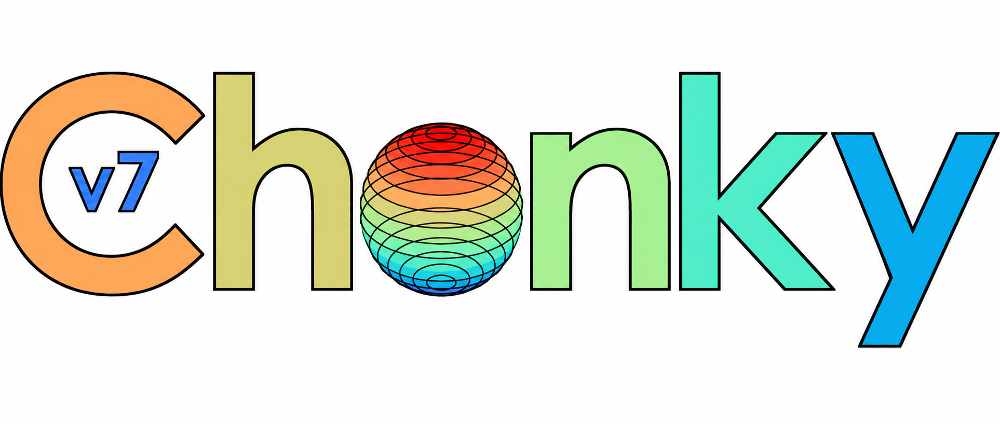
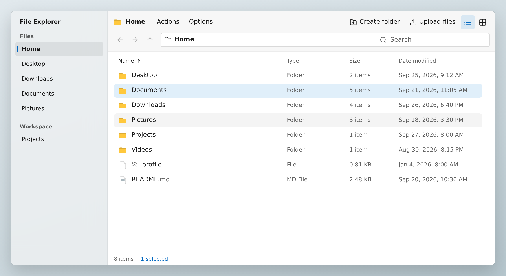
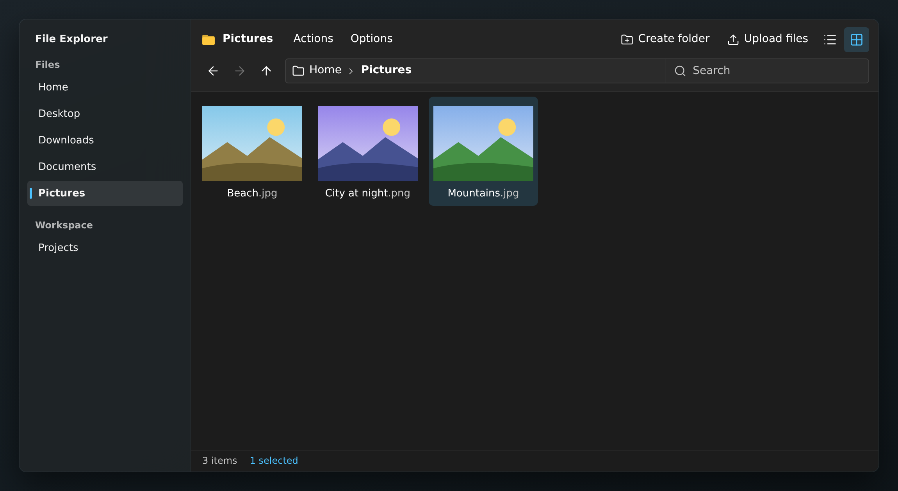
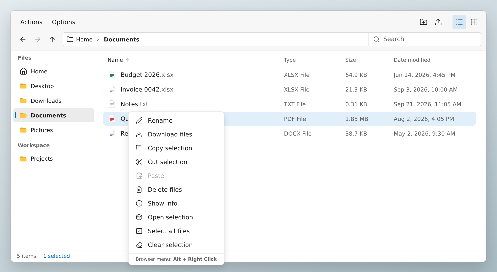
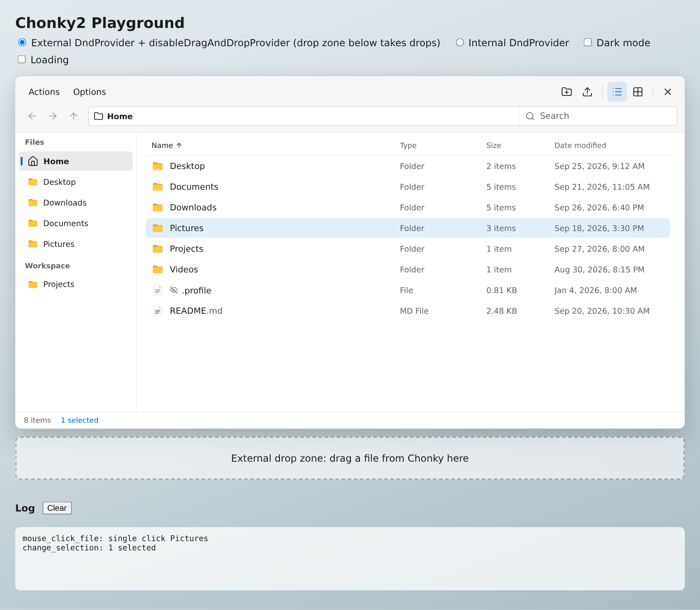

<p align="center">
    
    <br />
    <a href="https://www.npmjs.com/package/chonky2">
        
    </a>
    <a href="https://tldrlegal.com/license/mit-license">
        
    </a>
    <a href="https://www.npmjs.com/package/chonky2">
        
    </a>
    <a href="https://github.com/owlpro/chonky2">
        
    </a>
    <br /><br />
</p>

# Chonky2

**A file explorer for React apps.** Chonky2 puts a complete, desktop-style file manager on a
web page: folders and files in a list or grid, a sidebar, breadcrumbs, Back and Forward,
search, multi-select, drag and drop, copy and paste, inline rename, a right-click menu and
keyboard shortcuts. Its familiar desktop-style interface can be adapted to your app.

Chonky2 only draws the explorer and handles the user's interaction. It doesn't read a disk or
call a server: your app gives it the files to show and decides what happens when the user
opens, moves, renames, uploads or deletes something. That makes it fit any storage, whether
it is a REST API, S3, Firebase, a CMS media library or data in memory.

<p align="center">
    
</p>

<p align="center">
    
</p>

## Contents

- [What is Chonky2?](#what-is-chonky2)
  - [How it works](#how-it-works)
  - [Features](#features)
  - [What's new in v7](#whats-new-in-v7)
- [Getting started](#getting-started)
  - [Installation](#installation)
  - [Quick start](#quick-start)
- [Guides](#guides)
  - [Actions](#actions)
  - [Creating and renaming](#creating-and-renaming)
  - [Copy, cut and paste](#copy-cut-and-paste)
  - [Drag and drop](#drag-and-drop)
  - [Search](#search)
  - [Sidebar](#sidebar)
  - [Favorites, Recent and user state](#favorites-recent-and-user-state)
  - [Toolbar content](#toolbar-content)
  - [Loading](#loading)
  - [Keyboard and mouse](#keyboard-and-mouse)
  - [Building your own layout](#building-your-own-layout)
- [Reference](#reference)
  - [Props](#props)
  - [File fields](#file-fields)
  - [Ref methods](#ref-methods)
  - [Theming](#theming)
  - [Custom icons](#custom-icons)
  - [Translations](#translations)
- [Playground](#playground)
- [Upgrading](#upgrading)
- [Development](#development)
- [Changelog, license and links](#changelog-license-and-links)

---

## What is Chonky2?

Many web apps need to let users browse and manage files: an admin panel's media library, a
cloud storage front end, an asset picker in a CMS, a document portal. Building that UI well
takes a lot of work: selection with Shift and Ctrl, drag and drop, virtualized lists for
thousands of files, keyboard navigation, context menus, thumbnails, sorting. Chonky2 is that
UI, ready to drop into a React app.

It is a maintained and modernized fork of [Chonky](https://github.com/TimboKZ/Chonky), with a
an updated design, no UI framework dependency and many new features.

### How it works

Chonky2 is a *controlled* component. It needs three things from your app:

1. **`files`**: the files and folders in the folder being shown.
2. **`folderChain`**: the path to that folder, from the root. It feeds the breadcrumbs,
   the Up button and the sidebar highlight.
3. **`onFileAction`**: a function Chonky calls for everything the user does. When the user
   opens a folder, your app loads its files and passes them back in; when they rename or
   delete something, your app calls its API and passes in the updated list.

Everything that only affects the view (selection, sorting, list or grid view, search in the
current folder, Back and Forward history) works on its own.

### Features

- **Two views:** a list with sortable Name, Type, Size and Date columns, and a grid with
  image thumbnails. Both are virtualized, so folders with thousands of files stay fast.
- **Navigation:** breadcrumbs, Back, Forward, Up, a sidebar, and the mouse's back and
  forward buttons. After going up, the folder you came from is selected.
- **Selection:** click, Ctrl+click, Shift+click and Ctrl+A.
- **Phones and tablets:** a tap opens a file, a long press opens the context menu, and while
  Chonky is narrow the sidebar becomes a drawer and the toolbar buttons go into a menu.
- **File operations:** create folder, upload, download, delete, inline rename (F2), and copy,
  cut and paste (Ctrl+C, Ctrl+X, Ctrl+V), each opt-in.
- **Drag and drop:** move files into folders, breadcrumbs and sidebar items, and upload files
  dragged in from the computer.
- **Search:** filters the current folder as you type; your app can search further.
- **Context menu, toolbar menus and keyboard shortcuts** for every action, including your own.
- **Loading state**, broken-thumbnail fallback, a dark theme, and theming with CSS variables.
- **Translations** with ICU messages and the browser's `Intl` formatting.
- **TypeScript** types included; works with Vite, ESM and CommonJS.

### What's new in v7

- A refreshed file explorer interface with colour-coded file icons, a sidebar and a
  built-in dark theme.
- Material UI, Emotion, styled-components and JSS are gone. Styles are plain CSS, injected
  automatically and themed with CSS variables. The only peer dependencies are `react` and
  `react-dom`.
- `react-intl` was replaced by a small formatter built on the browser's `Intl` APIs.
- Chonky's cost in an app bundle dropped from about 139 KB to about 66 KB (minified + brotli,
  all dependencies included).
- Inline rename, copy/cut/paste, drag-and-drop upload, a sidebar, a loading state and more.
  See the [changelog](./CHANGELOG.md) for the full list, and [Upgrading](#upgrading) if you
  use 6.x.

---

## Getting started

### Installation

```bash
npm install chonky2
# or
yarn add chonky2
# or
pnpm add chonky2
```

| Requirement | Version |
|---|---|
| React and React DOM | 19 or newer (peer dependencies) |
| TypeScript | Optional; types are included |
| Browsers | Current Chrome, Edge, Firefox and Safari |

There is nothing else to set up: icons and styles are part of the package and are injected
when Chonky renders.

### Quick start

This example keeps two folders in memory. Opening a folder, the breadcrumbs, Up, Back and
Forward all arrive as `OpenFiles`, so one handler covers navigation.

```tsx
import { useState } from 'react';
import { ChonkyActions, FileActionHandler, FileData, FullFileBrowser } from 'chonky2';

const folders: Record<string, FileData[]> = {
  root: [
    { id: 'docs', name: 'Documents', isDir: true },
    { id: 'photo', name: 'Photo.png', size: 2_100_000, modDate: new Date() },
  ],
  docs: [{ id: 'report', name: 'Report.pdf', size: 480_000 }],
};
const names: Record<string, string> = { root: 'Home', docs: 'Documents' };

export default function Explorer() {
  const [path, setPath] = useState(['root']);

  const handleFileAction: FileActionHandler = (data) => {
    if (data.id === ChonkyActions.OpenFiles.id) {
      const target = data.payload.targetFile ?? data.payload.files[0];
      if (!target?.isDir) return;
      // Opening a folder that is already in the path (breadcrumbs, Up, Back) goes back to it.
      const index = path.indexOf(target.id);
      setPath(index >= 0 ? path.slice(0, index + 1) : [...path, target.id]);
    }
  };

  const currentId = path[path.length - 1] ?? 'root';
  return (
    <div style={{ height: 500 }}>
      <FullFileBrowser
        files={folders[currentId] ?? []}
        folderChain={path.map((id) => ({ id, name: names[id] ?? id, isDir: true }))}
        onFileAction={handleFileAction}
      />
    </div>
  );
}
```

Chonky fills the height of its container, so give the container a height. With a real
backend, load the folder's files in the `OpenFiles` handler and pass [`loading`](#loading)
while they load.

---

## Guides

### Actions

Everything the user does is an *action*, delivered to `onFileAction` with its `id`, a
`payload` and the `state` (such as the selected files). Built-in actions such as selection,
sorting and view switching work on their own; the ones that change your data only tell you
what the user wants.

| Action | When it fires | Payload / state |
|---|---|---|
| `OpenFiles` | Double click, a tap on touch screens, Enter, breadcrumbs, Up, Back, Forward, sidebar | `payload.targetFile`, `payload.files` |
| `MoveFiles` | Files dropped onto a folder, or cut files pasted | `payload.files`, `payload.destination` |
| `CopyFilesTo` | Copied files pasted | `payload.files`, `payload.destination` |
| `ChangeFileName` | A new name confirmed in the inline rename field | `payload.file`, `payload.name` |
| `ChangeSelection` | Selection changed | `payload.selection` (a `Set` of IDs) |
| `ChangeSearch` | Search text changed (after typing stops, Enter, Esc, or cleared by navigating) | `payload.searchString` (trimmed) |
| `DropFiles` | Files dragged in from the computer are dropped | `payload.files` (`File[]`), `payload.destination` |
| `CreateFolder`, `UploadFiles`, `DownloadFiles`, `CopyFiles`, `CutFiles`, `DeleteFiles` | Their button, menu item or shortcut | `state.selectedFilesForAction` |
| `AddToFavorites`, `RemoveFromFavorites` | Their menu item; Chonky updates the [user state](#favorites-recent-and-user-state) itself | `state.selectedFilesForAction` (folders) |

`CreateFolder`, `UploadFiles`, `DownloadFiles`, `CopyFiles`, `CutFiles`, `PasteFiles`,
`RenameFile`, `DeleteFiles`, `DropFiles`, `AddToFavorites` and `RemoveFromFavorites` are opt-in: pass the ones your app supports in
`fileActions`, and they appear in the toolbar, menus and context menu.

```tsx
<FullFileBrowser
  files={files}
  folderChain={folderChain}
  fileActions={[ChonkyActions.CreateFolder, ChonkyActions.UploadFiles, ChonkyActions.RenameFile, ChonkyActions.DeleteFiles]}
  onFileAction={(data) => {
    if (data.id === ChonkyActions.CreateFolder.id) {
      api.createFolder(currentFolderId, 'New folder'); // the user renames it in place
    } else if (data.id === ChonkyActions.UploadFiles.id) {
      openYourUploadDialog();
    } else if (data.id === ChonkyActions.DropFiles.id) {
      api.upload(data.payload.files, data.payload.destination.id);
    } else if (data.id === ChonkyActions.ChangeFileName.id) {
      api.rename(data.payload.file.id, data.payload.name);
    } else if (data.id === ChonkyActions.DeleteFiles.id) {
      api.delete(data.state.selectedFilesForAction.map((file) => file.id));
    }
  }}
/>
```

<p align="center">
    
</p>

Custom actions are created with `defineFileAction`. Actions with a `button.group` appear in
that group's toolbar menu (e.g. `Actions`, `Options`) and, with `button.contextMenu`, in the
context menu; actions without a group get their own toolbar button:

```tsx
const ShowInfo = defineFileAction({
  id: 'show_info',
  requiresSelection: true,
  button: { name: 'Show info', toolbar: true, contextMenu: true, group: 'Actions', icon: ChonkyIconName.info },
});
```

### Creating and renaming

`RenameFile` (F2) turns the selected file's name into a text field, with the name before the
extension selected. Enter or clicking elsewhere confirms, Esc cancels, and a changed name
reaches you as `ChangeFileName`. Files with `renamable: false` can't be renamed.

After `CreateFolder`, create the folder in your backend and pass the new list in: the first
new folder that shows up is selected and put into the same rename field, with its whole name
selected. Files that show up after `UploadFiles`, `DropFiles` or `PasteFiles` are selected
and scrolled into view.

### Copy, cut and paste

`CopyFiles` (Ctrl+C) and `CutFiles` (Ctrl+X) put the selection on Chonky's clipboard; cut
files are shown faded. `PasteFiles` (Ctrl+V) pastes into the current folder, or into the
folder its context menu was opened on. Copies arrive as `CopyFilesTo` and cut files as
`MoveFiles`, both with `payload.files` and `payload.destination`.

### Drag and drop

- **Moving files.** Files dragged onto a folder in the list, a breadcrumb or a sidebar item
  arrive as `MoveFiles`. Folders in the list open when a drag hovers over them.
- **Uploading.** Files dragged in from the computer can be dropped anywhere on Chonky and
  arrive as `DropFiles`, with the current folder, or the folder they were dropped on, as
  `payload.destination`. `DropFiles` is added automatically when `UploadFiles` is registered,
  so handle it along with `UploadFiles`.
- **Your own drop targets.** `useFolderDropTarget(folder)` makes an element outside Chonky a
  drop target for files dragged from Chonky; a drop there arrives as `MoveFiles`. It needs
  Chonky and your app to share one react-dnd context:

```tsx
<DndProvider backend={HTML5Backend}>
  <MyFolderTree />
  <FullFileBrowser {...props} disableDragAndDropProvider />
</DndProvider>

const MyFolderItem = ({ folder }: { folder: FileData }) => {
  const { dropRef, isOver, canDrop } = useFolderDropTarget(folder);
  return <button ref={dropRef} className={isOver && canDrop ? 'drop-over' : ''}>{folder.name}</button>;
};
```

### Search

The search field filters the current folder: a file is shown when every word typed is part
of its `name` or its `searchText`. The search is cleared when the folder changes, and files it
hides are deselected. To find files outside the current folder, handle `ChangeSearch`, open
the folder the file is in, and reveal it through the [ref](#ref-methods):

```tsx
const browserRef = useRef<FileBrowserHandle>(null);

const handleAction: FileActionHandler = async (data) => {
  if (data.id === ChonkyActions.ChangeSearch.id) {
    const media = await findMediaById(data.payload.searchString); // your API
    if (!media) return;
    openFolder(media.folderId);                 // update folderChain and files
    browserRef.current?.revealFiles([media.id]); // selected and scrolled to once listed
  }
};
```

### Sidebar

The `sidebar` prop puts a navigation pane left of the file list. Build it from
`FileSidebar`, `FileSidebarSection` and `FileSidebarItem`:

```tsx
<FullFileBrowser
  {...props}
  sidebar={
    <FileSidebar>
      <FileSidebarItem folder={home} icon={ChonkyIconName.home} />
      <FileSidebarFavorites />
      <FileSidebarSection id="folders" title="Folders">
        {topFolders.map((folder) => <FileSidebarItem key={folder.id} folder={folder} />)}
      </FileSidebarSection>
    </FileSidebar>
  }
/>
```

An item opens its `folder` with `OpenFiles`, like a breadcrumb, so your `OpenFiles` handler
decides the new `folderChain`. Files dragged onto an item are moved into its folder, or
uploaded into it when they come from the computer. An item is highlighted while its folder is
the current folder or one of its ancestors (not counting the root); pass `active` to decide
yourself, `label` and `icon` to override the folder's, or `onClick` to do something else. The
sidebar's width is `--chonky-sidebar-width`. When Chonky is 560px wide or narrower, e.g. on a
phone, the sidebar becomes a drawer over the file list and the status bar: a menu button in the
navbar (in place of Forward) opens it, and a tap outside it, Esc or choosing an item closes it.

Sections with a title collapse when the title is clicked, like the views in VS Code's side
bar: a collapsed section shows only its title. Sections keep their order, so a collapsed
section stays at the top when no open section comes before it and goes to the bottom
otherwise. Open sections
share the height (none grows past its content) and each scrolls on its own. The collapsed
sections are remembered in the [user state](#favorites-recent-and-user-state) under the section's
`id` (its `title` when that is a string); pass `collapsible={false}` to keep a section open,
and `icon` to show an icon before the title.

### Favorites, Recent and user state

`FileSidebarFavorites` is a sidebar section with the user's favorite folders. Folders are
added by dropping them onto the section or its title (the star turns yellow while a drop would
add them, and a collapsed section opens) or with the `AddToFavorites` action, reordered by
dragging, and removed with their ✕ button or `RemoveFromFavorites`. Clicking a favorite opens
it with `OpenFiles`, and files dropped onto it are moved into it.

`FileSidebarRecent` lists the files the user opened last (`OpenFiles`), newest first; folders
aren't listed. Clicking one opens it again and its ✕ button removes it. It keeps `limit` files
(default 10), and opened files are only recorded while the section is shown.

Favorites, recent files and collapsed sections make up the *user state* (`ChonkyUserState`). Chonky can
keep it in the browser, or leave it to your app so it follows the user between devices:

```tsx
// In localStorage, one entry per user
<FullFileBrowser {...props} userStateStorageKey={`files:${user.id}`} />

// On your server: Chonky reports changes and shows them once you pass the new state back
const [userState, setUserState] = useState(user.fileBrowserState);
<FullFileBrowser
  {...props}
  userState={userState}
  onUserStateChange={(next) => {
    setUserState(next);
    api.saveFileBrowserState(user.id, next);
  }}
/>
```

`onUserStateChange` is also called with `userStateStorageKey`, e.g. to log changes.
Favorites are saved copies of the folders' `FileData`: a favorite is renamed when its folder
shows up in `files` or `folderChain` with a new name, but a deleted folder stays until the
user removes it (or your app drops it from `userState`).

### Toolbar content

`toolbarStart` (before the menus) and `toolbarEnd` (after the view buttons, behind a divider)
take your own elements, such as a close button when Chonky is in a dialog. `ToolbarButton`
looks like Chonky's buttons, and its `icon` can be a `ChonkyIconName` or any element:

```tsx
<FullFileBrowser
  {...props}
  toolbarEnd={<>
    <ToolbarButton icon={ChonkyIconName.refresh} iconOnly text="Refresh" onClick={reload} />
    <ToolbarButton icon={ChonkyIconName.close} iconOnly text="Close" onClick={closeDialog} />
  </>}
/>
```

### Loading

Pass `loading` while you fetch a folder. A progress bar runs along the top of the file list,
and an empty list shows a spinner and "Loading…" instead of "Nothing to show". Files already
passed stay visible, so a refresh can keep the old list while it loads. For placeholders of a
known size, pass `null` entries in `files`.

### Keyboard and mouse

Shortcuts apply while focus is inside Chonky (clicking anywhere in it puts it there), or on
an element around it, such as a dialog that just opened with Chonky in it. They are left to
the page while Chonky is hidden (e.g. in a closed dialog that stays mounted), when another
Chonky is visible in the same place, or when the user has selected other text on the page.
Each shortcut belongs to an action and only works when that action is registered;
`disableDefaultFileActions` also turns off the default ones, such as Ctrl+A.

| Keys | Action |
|---|---|
| Enter | Open the selection |
| Ctrl+A (Cmd+A) | Select all files |
| Esc | Clear the selection |
| Backspace | Go up a folder |
| Alt+← / Alt+→, mouse back / forward buttons | Back / Forward |
| Ctrl+F | Focus the search field |
| Ctrl+H | Show or hide hidden files |
| F2 | Rename the selected file (`RenameFile`) |
| Ctrl+C, Ctrl+X, Ctrl+V (Cmd on macOS) | Copy, cut, paste (`CopyFiles`, `CutFiles`, `PasteFiles`) |
| Delete | Delete the selection (`DeleteFiles`) |

On touch screens a tap opens a file or folder, and a long press opens the context menu for
it. Buttons and list rows are taller there, and hover effects only show with a mouse.

While Chonky is 560px wide or narrower, the toolbar buttons other than the view modes go into
a "More" (⋯) menu. At 480px or narrower the search field is an icon that covers the address
bar while it has focus or text. The list drops its Type column when it is 680px wide or
narrower and its Date column at 480px, so names keep their room.

### Building your own layout

`FullFileBrowser` is a shortcut for the parts below. Use them directly to leave some out or
to arrange them yourself:

```tsx
import {
  FileBrowser, FileContextMenu, FileList, FileNavbar, FileStatusBar, FileToolbar,
} from 'chonky2';

<FileBrowser files={files} folderChain={folderChain} onFileAction={handleFileAction}>
  <FileToolbar />     {/* one menu per action group, action buttons, view buttons */}
  <FileNavbar />      {/* Back, Forward, Up, breadcrumbs and search */}
  <FileList />        {/* list, grid or compact view */}
  <FileStatusBar />   {/* item, selection and hidden-file counts */}
  <FileContextMenu /> {/* right-click menu */}
</FileBrowser>
```

With your own layout, pass toolbar content to `FileToolbar` as `startContent` and `endContent`.

---

## Reference

### Props

`FullFileBrowser` and `FileBrowser` take these props. Only `files` is required.

| Prop | Type | Description |
|---|---|---|
| `files` | `(FileData \| null)[]` | Files in the current folder. `null` entries show as loading placeholders. |
| `folderChain` | `(FileData \| null)[]` | Path from the root to the current folder. |
| `onFileAction` | `(data) => void` | Called for every [action](#actions). |
| `fileActions` | `FileAction[]` | Extra actions, such as the opt-in ones or your own. |
| `disableDefaultFileActions` | `boolean \| string[]` | Turns off all default actions (selection, views, sorting, …), or the ones with these IDs. |
| `defaultFileViewActionId` | `string` | Starting view, e.g. `ChonkyActions.EnableListView.id`. |
| `defaultSortActionId` | `string \| null` | Starting sort, e.g. `ChonkyActions.SortFilesByDate.id`. |
| `loading` | `boolean` | Shows the [loading state](#loading). |
| `darkMode` | `boolean` | Uses the dark theme. |
| `disableAnimations` | `boolean` | Turns off Chonky's animations (menus, sidebar sections); loading indicators keep moving. Also off when the system asks for reduced motion. |
| `sidebar` | `ReactNode` | [Sidebar](#sidebar) left of the file list (`FullFileBrowser` only). |
| `userState`, `onUserStateChange` | `Partial<ChonkyUserState>`, `(state) => void` | Favorites, recent files and collapsed sidebar sections, kept by your app. See [user state](#favorites-recent-and-user-state). |
| `userStateStorageKey` | `string` | Keeps the [user state](#favorites-recent-and-user-state) in `localStorage` under this key when `userState` isn't passed. |
| `toolbarStart`, `toolbarEnd` | `ReactNode` | [Toolbar content](#toolbar-content) (`FullFileBrowser` only). |
| `thumbnailGenerator` | `(file) => string \| null \| Promise<…>` | Returns each file's thumbnail URL, instead of `thumbnailUrl`. |
| `i18n` | `I18nConfig` | [Translations](#translations) and formatters. |
| `iconComponent` | `ElementType` | Replaces Chonky's [icons](#custom-icons). |
| `disableSelection` | `boolean` | Turns off selection. |
| `disableDragAndDrop` | `boolean` | Turns off drag and drop. |
| `disableDragAndDropProvider` | `boolean` | Uses your app's react-dnd `DndProvider` instead of Chonky's own. |
| `clearSelectionOnOutsideClick` | `boolean` | Clears the selection on clicks outside Chonky or on empty list space (default `true`). |
| `doubleClickDelay` | `number` | Longest gap between the clicks of a double click, in ms (default `300`). |
| `onScroll` | `(event) => void` | Called when the file list scrolls. |

Defaults for every Chonky on the page can be set once with `setChonkyDefaults({ ... })`.

### File fields

Each file is a plain object. Only `id` and `name` are required:

```ts
{
  id: 'report',
  name: 'Report.pdf',
  isDir: false,
  size: 480_000,                      // bytes, shown in the Size column
  modDate: new Date(),                // Date modified column
  childrenCount: 3,                   // folders: shown as "3 items"
  thumbnailUrl: '/thumbs/report.png', // shown in the grid view
  color: '#e53935',                   // overrides the icon colour
  isHidden: false,                    // hidden unless "Show hidden files" is on
  renamable: true,                    // false: RenameFile is off for this file
  searchText: 'https://cdn.example.com/f/9f3c2e', // also matched by the search field
}
```

A thumbnail pulses while its image loads, and shows a broken image icon if the image fails
to load. Other fields, such as your own data, are kept and come back in action payloads.

### Ref methods

Pass a `ref` to `FullFileBrowser` or `FileBrowser` to get a `FileBrowserHandle`:

| Method | Description |
|---|---|
| `getFileSelection()` | The selected file IDs, as a `Set`. |
| `setFileSelection(ids, reset = true)` | Selects these IDs, replacing or adding to the selection. |
| `revealFiles(ids, select = true)` | Scrolls to the files and selects them. Files not listed yet are revealed when they show up. |
| `requestFileAction(action, payload)` | Runs an action as if the user had triggered it. |

### Theming

Pass `darkMode` for the built-in dark theme. To change colours, fonts or sizes, override the
CSS variables on `.chonky-theme` from your own stylesheet:

```css
.chonky-theme {
    --chonky-accent: #7b1fa2;
    --chonky-font: 'Vazirmatn', sans-serif;
    --chonky-control-height: 36px;
}

/* Dark theme values */
.chonky-theme.chonky-dark {
    --chonky-accent: #ce93d8;
}
```

| Variable | Controls |
|---|---|
| `--chonky-accent` | Selection, focus ring, active buttons |
| `--chonky-font`, `--chonky-font-size` | Text |
| `--chonky-bg`, `--chonky-chrome-bg` | File list and toolbar backgrounds |
| `--chonky-text`, `--chonky-text-secondary` | Text colours |
| `--chonky-selected-bg`, `--chonky-hover` | Row and tile states |
| `--chonky-radius`, `--chonky-control-height` | Corners and button height |
| `--chonky-list-type-width`, `--chonky-list-size-width`, `--chonky-list-date-width` | List column widths |
| `--chonky-sidebar-width` | Sidebar width |
| `--chonky-status-bar-height` | Status bar height (default `28px`) |
| `--chonky-scrollbar-thumb` | Colour of the thin scrollbars |
| `--chonky-menu-z-index` | Stacking order of the menus, which render on `<body>` (default `2000`, above most dialogs) |

The full list is at the top of [`src/styles/chonky.css`](./src/styles/chonky.css). Chonky has
a border and rounded corners; remove them with
`.chonky-chonkyRoot { border: 0; border-radius: 0; }` when it fills a window of your own.

### Custom icons

File icons are drawn by Chonky: a folder, or a page labelled with the file's extension in a
colour per file type. Toolbar and menu icons come from [Lucide](https://lucide.dev/). To use
your own icon set everywhere, pass `iconComponent`, a component that receives
`{ icon, spin, className, style }` where `icon` is a `ChonkyIconName`.

### Translations

Pass a locale and translated messages through `i18n`. Messages use ICU syntax (`{arg}`,
`plural`, `select`, `selectordinal`, `#`); numbers, dates and plural rules come from the
browser's `Intl` APIs.

```tsx
<FullFileBrowser
  files={files}
  i18n={{
    locale: 'fa',
    messages: {
      'chonky.toolbar.searchPlaceholder': 'جست‌وجو',
      'chonky.toolbar.visibleFileCount': '{fileCount, plural, other {# مورد}}',
      'chonky.fileList.nameColumn': 'نام',
      'chonky.actions.open_files.button.name': 'باز کردن',
    },
  }}
/>
```

Message IDs follow the pattern `chonky.<area>.<name>`:

| Area | IDs |
|---|---|
| `toolbar` | `searchPlaceholder`, `clearSearch`, `visibleFileCount`, `selectedFileCount`, `hiddenFileCount`, `toggleSidebar`, `moreActions` |
| `fileList` | `nothingToShow`, `loading`, `nameColumn`, `typeColumn`, `sizeColumn`, `dateColumn` |
| `fileEntry` | `folderType`, `fileType`, `genericFileType`, `folderItemCount` |
| `contextMenu` | `browserMenuShortcut` |
| `sidebar` | `favorites`, `favoritesDropHint`, `removeFavorite`, `recent`, `recentEmpty`, `removeRecent` |
| `actions` | `<actionId>.button.name`, `<actionId>.button.tooltip` |
| `actionGroups` | `<group name>`, e.g. `Actions`, `Options` |

To change how dates, sizes or file types are written, pass `i18n.formatters` with any of
`formatFileModDate`, `formatFileModTime`, `formatFileSize` and `formatFileType`.

---

## Playground

The repository has a playground: a full explorer window with sample folders and pictures,
where every feature works and every event Chonky sends is logged. It is the quickest way to
see Chonky in action, and the place to try changes to Chonky itself.

```bash
git clone https://github.com/owlpro/chonky2.git
cd chonky2
yarn install
yarn dev
```

Then open http://localhost:5173. `yarn dev` builds the library in watch mode and serves the
playground against the build, so changes in `src/` show up after a reload.

<p align="center">
    
</p>

What you can try:

- Create, upload, rename, delete, copy, cut and paste files; drop files from your computer
  onto the list, a folder or the sidebar.
- **External DndProvider / Internal DndProvider** switch between Chonky's own drag-and-drop
  context and an app-level one; with the external one, files can be dragged onto the drop
  zone below the window (`useFolderDropTarget`).
- **Dark mode**, **Disable animations** and **Loading** toggle the `darkMode`,
  `disableAnimations` and `loading` props.
- **User** switches between two users, each with their own favorites, recent files and collapsed sidebar
  sections, kept in `localStorage` with `userStateStorageKey`.
- *Downloads* has a picture whose thumbnail is missing, to show the broken image icon.
- The **Log** lists each action with its payload, e.g. `move_files: Report.pdf → Desktop`.

The code is in [`playground/`](./playground): `main.tsx` shows how an app handles the
actions, and `data.ts` holds the sample files.

---

## Upgrading

### From Chonky2 6.x

- Uninstall `@mui/material`, `@mui/styled-engine-sc`, `@emotion/react`, `@emotion/styled` and
  `styled-components` if your app doesn't use them itself.
- Style overrides that target MUI classes or the old `chonky-*` class names need to move to
  the new CSS variables.
- The search field is now part of `FileNavbar`, and the item count moved to `FileStatusBar`.
  If you compose the parts yourself, add them.
- `react-intl` options other than `locale`, `defaultLocale`, `messages` and `timeZone` are
  ignored, and custom formatters receive a `ChonkyIntl` object instead of `IntlShape`.
- Registering `UploadFiles` now also registers `DropFiles`; handle it to upload dropped files.

The full list is in the [changelog](./CHANGELOG.md).

### From the original Chonky

1. Replace the packages:

   ```bash
   npm uninstall chonky chonky-icon-fontawesome
   npm install chonky2
   ```

2. Update your imports:

   ```diff
   - import { FileBrowser } from 'chonky';
   + import { FileBrowser } from 'chonky2';
   ```

3. Remove `setChonkyDefaults({ iconComponent: ChonkyIconFA })` and other FontAwesome setup;
   icons are built in.

---

## Development

```bash
yarn install
yarn dev            # playground at http://localhost:5173, rebuilds the library on change
yarn build          # builds dist/
yarn size           # checks the bundle size limit
yarn watch:linked   # builds dist-linked/ on every change, for testing in another app
npx vitest run test/search.test.ts   # store tests
```

To try changes inside an app built with Vite, run `yarn watch:linked`. It rebuilds
`dist-linked/index.es.js` on every change: unminified, with source maps and type
declarations, and with every dependency except React bundled in, so the app's own versions
of them can't be picked up instead. In the app:

- alias `chonky2` to that file in `vite.config`, allow Vite to serve the chonky2 folder
  (`server.fs.allow`) and exclude it from `@vitejs/plugin-react`;
- map `chonky2` to `dist-linked/index.d.ts` in `tsconfig.json` `paths`, so the editor sees
  the new types.

Every change to published code gets an entry in [CHANGELOG.md](./CHANGELOG.md) under
`[Unreleased]`.

---

## Changelog, license and links

- Changelog: [CHANGELOG.md](./CHANGELOG.md)
- npm: https://www.npmjs.com/package/chonky2
- GitHub: https://github.com/owlpro/chonky2
- Issues: https://github.com/owlpro/chonky2/issues

MIT © [Tim Kuzhagaliyev](https://github.com/TimboKZ)  
Maintained and upgraded by [Mahdi Amiri](https://github.com/owlpro)

### Sponsored by

<p align="center">
  <a href="https://vahdatoptic.com" target="_blank" style="text-decoration:none;">
    <br/>
    <b>Developed and enhanced with the support of</b><br/>
    <span style="font-size:1.2em; font-weight:600; color:#0073e6;">Vahdat Optic</span><br/>
    <a href="https://vahdatoptic.com" target="_blank" style="color:#ffac5c; font-weight:500;">https://vahdatoptic.com</a>
  </a>
</p>
